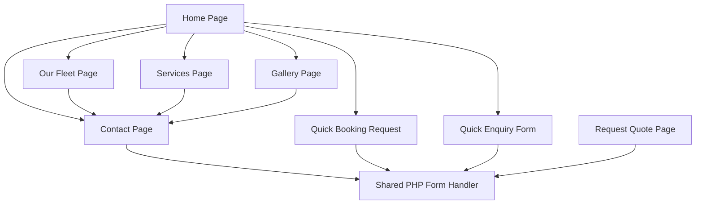
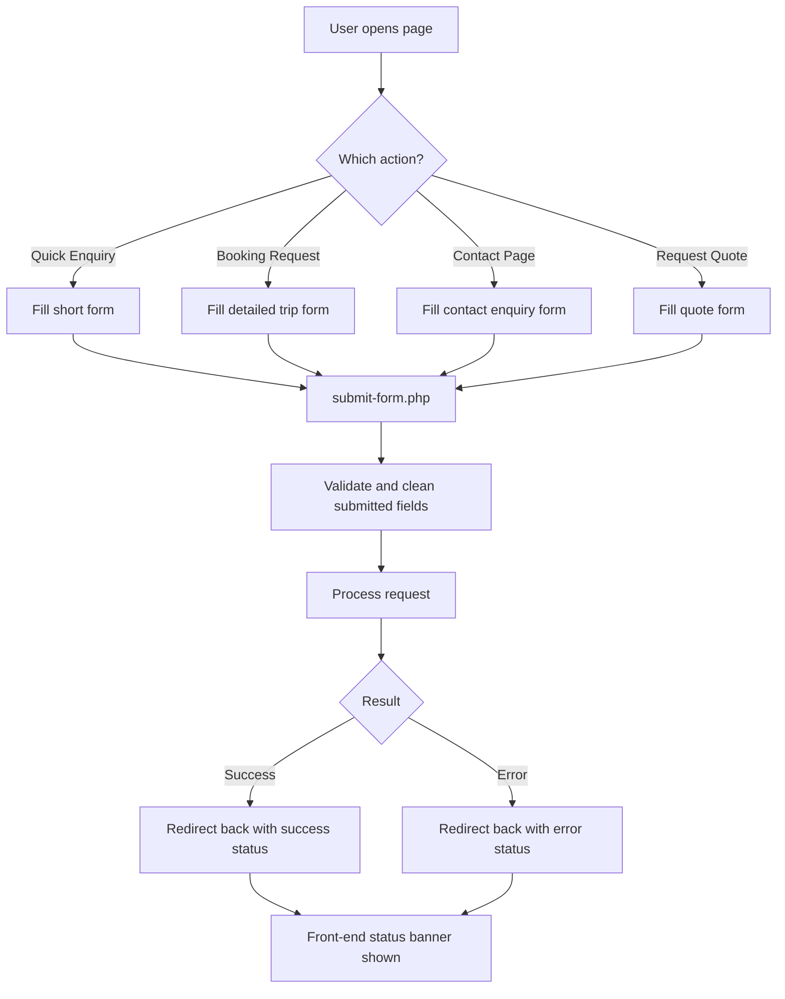

# Luxury Fleet Services

Premium multi-page transportation website built for Orlando luxury ride bookings.  
This project is implemented with HTML, CSS, JavaScript, and PHP, with a strong focus on responsive layouts, booking flows, fleet presentation, and conversion-driven landing sections.

## Project Goal

Build a complete luxury transportation website that:

- showcases premium ride services
- presents fleet and child-seat options clearly
- captures enquiries and booking requests from multiple pages
- works across desktop and mobile
- provides a smooth, premium-looking front-end experience

## Tech Stack

- HTML5
- CSS3
- Vanilla JavaScript
- PHP
- Remix Icon CDN

## Current File Structure

- `index.html` - main home page
- `services.html` - services details and rates
- `fleet.html` - vehicle fleet and child seat options
- `gallery.html` - image gallery with lightbox
- `contact.html` - contact page with detailed booking form
- `request-quote.html` - standalone quote form page
- `login.html` - login UI page
- `styles.css` - complete site styling and responsive rules
- `script.js` - interaction logic and UI behavior
- `submit-form.php` - server-side form processing
- `mail-config.php` - server-side mail settings file
- `assets/` - logos, images, and video files

## Work Completed From Start To End

### 1. Base Website Setup

- Multi-page site structure created.
- Shared header and footer added across pages.
- Local media assets integrated from `assets/`.
- Brand styling applied for a luxury transportation look.

### 2. Global Header and Navigation

- Fixed header implemented.
- Top contact strip added with phone and email.
- Scroll-based header state added.
- Mobile menu toggle added for smaller screens.
- Mobile navigation dropdown styling improved.
- Mobile open-menu background updated from dark black to a lighter gold-toned panel for better UI consistency.

### 3. Home Page Banner (Hero Section)

- Large visual hero banner created with video-based background.
- Dual-video handling added for the home banner.
- Image fallback/interlude support added.
- Rotating hero headline text animation added.
- Hero CTA buttons added (`Book Now`, `Our Fleet`).
- Quick Enquiry form added on the right side of the banner.
- Hero statistics/count-up cards added for trust signals.
- Long rotating text handling adjusted so the premium ride headline can render in a more compact state when shown.

### 4. Home Page Main Content

- `Reserve Your Orlando Car Service` section created with fleet cards.
- Home fleet cards include:
  - Executive Sedan
  - Executive SUV
  - Sprinter Van
- Child seat availability note added on home fleet cards:
  - Newborn
  - Toddler
  - Booster
- Service storytelling sections added.
- Why Choose section added.
- How It Works section added.
- Google reviews marquee section added.
- CTA section added.

### 5. Homepage Booking Forms

- Hero `Quick Enquiry` form added.
- `Quick Booking Request` section added with extended trip fields.
- Home booking form includes:
  - name
  - email
  - phone
  - car selection
  - pickup date/time
  - pickup location
  - return date/time
  - return location
  - service type
  - passengers
  - airline
  - flight number
  - child seat request
  - subject
  - message

### 6. Contact Page Enhancements

- Dedicated contact page layout added.
- Contact info panel added.
- Map embed added.
- Full enquiry/booking form added.
- Contact page form updated to match the home booking flow.
- Contact form also includes:
  - airline
  - flight number
  - child seat request

### 7. Fleet Page Enhancements

- Core fleet cards added for:
  - Executive Sedan
  - Executive SUV
  - Sprinter Van
- Vehicle capacity and luggage details added.
- Child seat availability note added to vehicle cards.
- Dedicated `Child Seat Options` section added.
- Child seat cards added with images for:
  - Newborn Seat
  - Infant Carrier
  - Toddler Seat
  - Booster Seat
- Placeholder price line added for child seat cards:
  - `Price: $xxx`

### 8. Gallery Page

- Gallery grid layout added.
- Hover captions added.
- Click-to-open lightbox added.
- Close behavior added for click-outside and keyboard escape.

### 9. Services Page

- Services presentation sections added.
- Service highlights and selling points added.
- Stats section added.
- Rates tables added.
- Responsive table handling added for smaller screens.

### 10. Footer Standardization Across Pages

- Footer shared structure added across major pages.
- `Fleet Options` footer column updated site-wide.
- Footer fleet links now include:
  - Executive Sedan
  - Executive SUV
  - Sprinter Van
  - Newborn Seat
  - Toddler Seat
  - Booster Seat

### 11. Form Submission System

- Multiple forms across the site submit to a shared PHP handler.
- Hidden form metadata is used to identify source page and redirect destination.
- Basic field cleanup and formatting are handled server-side.
- Success/error redirect status is returned to the front end.
- Front-end status banners are shown based on `form_status` query parameters.

### 12. Responsive and Mobile Improvements

- Hero layout adjusted for smaller screens.
- Home reserve card section improved for mobile with single-column layout.
- Contact form becomes single-column on mobile.
- Fleet and gallery layouts collapse into one column on smaller screens.
- Mobile navigation improved for readability and visual consistency.

## Key User-Facing Features

- Luxury branded landing page
- Video hero experience
- Rotating banner headline
- Quick enquiry capture
- Full booking request form
- Fleet showcase with child seat availability
- Child seat image section with pricing placeholders
- Services and rates presentation
- Gallery lightbox
- Contact page with map
- Shared footer navigation
- Responsive mobile behavior

## Page Flow Overview



## Booking / Enquiry Flowchart



## UI Section Map

```text
Home Page
|- Fixed Header
|- Hero Banner
|  |- Rotating Heading
|  |- CTA Buttons
|  |- Quick Enquiry Form
|  |- Stats Cards
|- Reserve Your Orlando Car Service
|- Services / Why Choose / How It Works
|- Quick Booking Request
|- Reviews
|- CTA
|- Footer
```

## Important Functional Notes

- All main enquiry and booking forms are connected to a common submission pipeline.
- Form source tracking is implemented using hidden fields like `form_title` and `redirect_to`.
- UI feedback after form submission is handled on the front end.
- Child seat requests are now visible both in forms and on fleet-related UI.
- Fleet footer links are synchronized across main pages.


## QA Sanity Check Notes (March 6, 2026)

- Interaction logic check:
  - `node --check script.js` passed
- PHP validation check:
  - `php -l submit-form.php` passed
  - `php -l mail-config.php` passed
- Responsive behavior reviewed and adjusted in CSS for:
  - desktop (`35/65` services layout)
  - tablet (stacked rates layout)
  - mobile (single-column cards and controls)

## Local Run Instructions

### Front-End Only

Open `index.html` directly in a browser, or run the project with Live Server in VS Code.

### With PHP Form Handling

Run the project from a local PHP-capable environment such as XAMPP and open the site through your local server URL.

## Notes

- This README reflects the currently implemented project state.
- Media files are loaded from the local `assets/` folder.
- The project is focused on practical lead generation, booking capture, and premium presentation.
